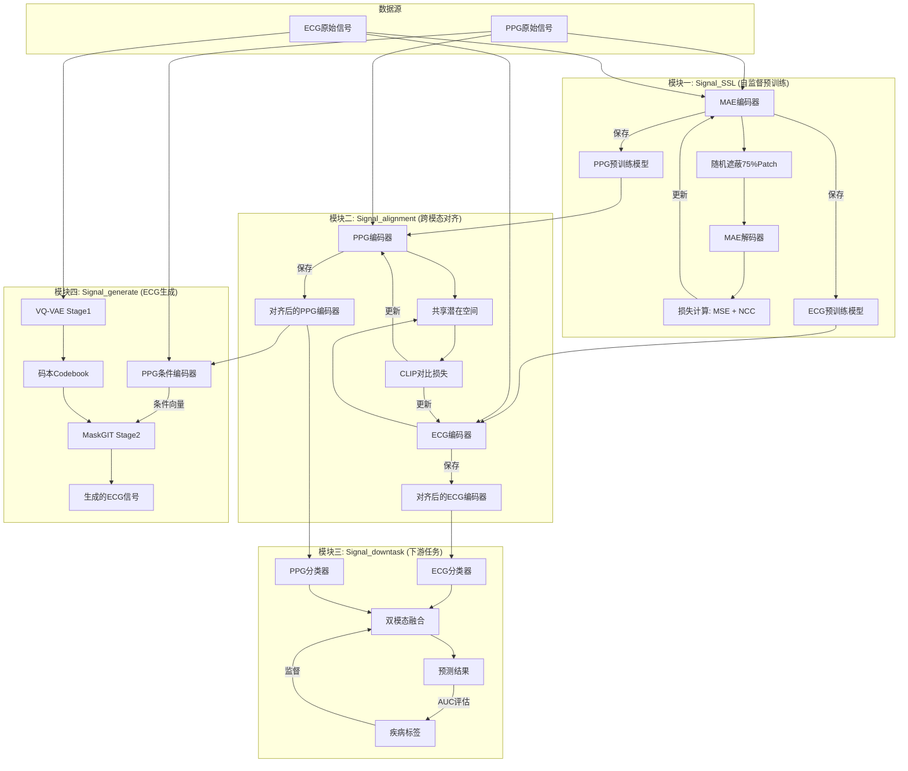

# CardioPPG

## Mermaid

## TODOLIST

- [ ] 生成gitignore, 排除之前错误的git管理(比如\_\_pycache\_\_), 创建一个全新的本地分支(基于), 并往这个分支上完成一次提交
- [ ] 安装环境和依赖
- [ ] 

## SSL

构建 MAE 编码器和 MAE 解码器, 即使没有标注也可以完成训练

ECG 和 PPG 数据**分别**进行训练

MAE 编码器完成对数据的编码, MAE 解码器尝试将数据还原, 并通过损失函数比对还原的数据和元数据的差异, 以此来训练数据

最后舍弃 MAE 解码器, 采用 MAE 编码器, 即可得到将原始数据映射到向量空间的模型

### MAE 编码器

1. ECG 数据输入 $1\times 2560$ 的张量
   - $1\times 2560$ 即单通道、2560 时间步长
2. 分块, 将张量分解成维度为 128 的 20 个 `patch`
3. 编码器从 Patch 中提取特征
   - 编码器使用 Vision Transformer 作为骨干网络处理时序信号
   - 输出 $[20, 768]$ (20个token，每个768维)
4. 采用固定的正弦余弦位置(索引)编码, 将位置编码注入(算术+)到每一个Patch token的每一个位置上(共有 $20\times768$ 个位置)
   - Transformer 本身是 **顺序无关** 的
   - 每个位置有唯一的编码向量
   - 位置相近的Patch，其编码向量也相近
   - 位置相差k的Patch，其编码向量的差异是固定的
5. 随机遮蔽( *mask* ) 75% 的 Patch, 仅保留 25% 的 Patch 交由编码器
   - 也就是说, 输出 $[5, 768]$ (5个token，每个768维)
   - 使用遮蔽, 促使编码器产生更高质量的 token 特征, 否则解码器难以还原
6. 添加 CLS Token
   - 一个特殊的分类token，用于全局信息汇总
   - 此时输出 $[5, 768]$ (5个 Patch 的 token, 以及一个 CLS 的token)
7. 再次经过 12 层 `Transformer Blocks` 训练
   - 让 token 依据 token 使用注意力机制获取到前后的上下文信息, 让 CLS 获取到所有非遮蔽的patch的信息
   - 依据非线性的运算获取更抽象的深层信息
8. 输出 $[6, 768]$ 的编码后的特征

### 解码器

非对称架构

- 解码器嵌入维度更低（512 vs 768），信息容量更小
- 解码器Transformer层数更少（8 vs 12），推理能力更弱
- 解码器注意力头数更多但维度更低，这是为了提升局部建模能力而非全局推理能力

这种不对称性确保解码器 **没有能力独立完成重建任务** ，它必须依赖编码器提供的高质量特征。

1. 用 `Linear` 将编码器的 768 维结果映射到 512 维
2. 扩充 Patch 的 shape, 到被遮蔽之前
3. 编码注入位置信息
4. 用 8 层 Transformer 进行还原
5. 用 `Linear` 将 Transformer 的输出映射到 ECG/PPG 的输入尺寸

## alignment

SSL 预训练出ECG编码器/PPG编码器

俩编码器各自将自己的原始数据编码映射到一片向量空间上

ECG和PPG向量之间两相对照, 对照然后更新编码器空间

最终产出的就是互相对齐后的ECG编码器/PPG编码器

### CEPP 模型

1. ECG编码器输出两组特征： ecg\_inter 和 ecg\_feature
   - ecg\_inter 中间层特征，无 Vision Transformer 的 head
   - ecg\_feature 最终特征，经过head投影到latent\_dim
2. PPG编码器同理输出 ppg\_inter 和 ppg\_feature
3. 将 ecg\_feature 和 ppg\_feature 送入CLIP损失函数计算对齐损失

### 对齐机制

通过CLIP损失的约束，实现以下目标：

1. 正样本对拉近 ：同一时刻采集的ECG和PPG信号，其特征向量在空间中距离尽可能近
2. 负样本对推远 ：不同时刻的ECG和PPG信号，其特征向量距离尽可能远

对于batch中的第i对信号，损失函数鼓励：

- sim(ecg\_i, ppg\_i) → 最大化
- sim(ecg\_i, ppg\_j) (j≠i) → 最小化

